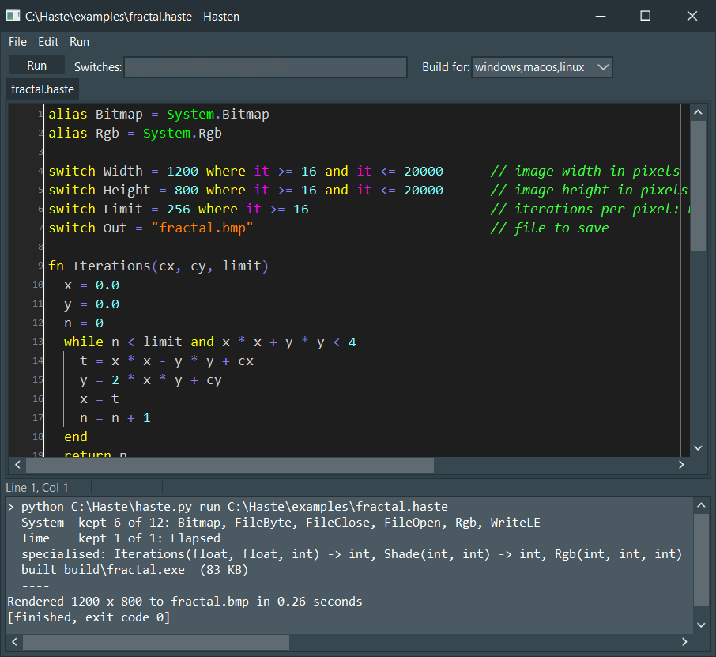

# Hasten, the Haste IDE

A Delphi VCL editor for Haste: tabs, Haste syntax highlighting, Run (F9) and Build (Ctrl+F9) through
`haste.py`, an output panel, and a jump to the line of each compiler error.

## Building

You need Delphi 10.3 or newer (Delphi 13 is fine) and [SynEdit](https://github.com/TurboPack/SynEdit)
(TurboPack, also in GetIt).

1. Run `SynHighlighterHaste.msg` through SynGen. It writes `SynHighlighterHaste.pas` next to it.
2. Open `Hasten.dpr` in Delphi. Add the SynEdit source folder to the search path if it isn't already.
3. Optional: Project > Options > Application > Icon: `..\assets\haste.ico`.
4. Build. The first Run looks for `haste.py` beside the exe and up to four folders above it (so
   `ide\Win64\Debug\Hasten.exe` finds the repository's `haste.py`), and asks if it can't find it.

## Using it

| Key | Does |
|---|---|
| F9 | Save, then `haste.py run` the current file, with the switches from the toolbar |
| Ctrl+F9 | Save, then `haste.py build` for the systems chosen in "Build for" |
| Ctrl+F2 | Stop the running program |
| Ctrl+N / Ctrl+O / Ctrl+S / Ctrl+W | New, open, save, close tab |
| Ctrl+F, F3 | Find, find next |
| Ctrl+G | Go to line |

A compiler error takes you straight to its line. Double-click any `file.haste:12` in the output to go
there. Settings and the files you had open are kept in `%APPDATA%\Hasten\Hasten.ini`.

## Files

| File | |
|---|---|
| `Hasten.dpr` | The program |
| `Hasten.Main.pas` | The main window, built entirely in code (no .dfm) |
| `Hasten.Highlighter.pas` | The generated highlighter plus built-ins, members and module names from `haste.py words`, so new modules are coloured without regenerating anything |
| `Hasten.Runner.pas` | Runs `haste.py` in the background and streams its output; Stop ends the whole process tree |
| `SynHighlighterHaste.msg` | SynGen description of Haste's syntax; colours designed with [SynEdit Msg Designer](https://groovermd.github.io/SynEditMsgDesigner/) |
